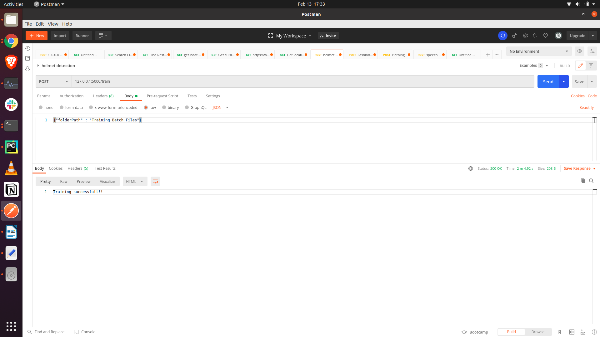
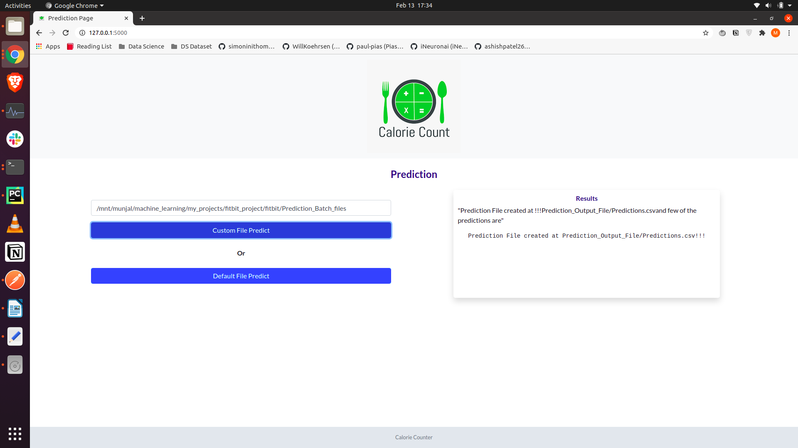

<h2> About the project </h2>

This is an End to End ML project to determine Calorie from fitbit health data. The project covers training and prediction 
pipelines. The project involves a regression model to predict the calories burnt based on the given indicators in the training data. 

<h2> Dataset </h2>

Dataset is taken from [fitbit dataset](https://www.kaggle.com/singhakash/fitbit-dataset?select=FitBit+data.csv) from 
kaggle. The data contains following features:

    1. Id: The customer ID
    2. ActivityDate: The date for which the activity is getting tracked.
    3. TotalSteps:  Total Steps taken on that day.
    4. TotalDistance: Total distance covered.
    5. TrackerDistance: Distance as per the tracker
    6. LoggedActivitiesDistance: Logged 
    7. VeryActiveDistance: The distance for which the user was the most active. 
    8. ModeratelyActiveDistance: The distance for which the user was moderately active.
    9. LightActiveDistance: The distance for which the user was the least active.
    10. SedentaryActiveDistance: The distance for which the user was almost inactive.
    11. VeryActiveMinutes: The number of minutes for the most activity.
    12. FairlyActiveMinutes: The number of minutes for moderately activity.
    13. LightlyActiveMinutes: The number of minutes for the least activity
    14. SedentaryMinutes: The number of minutes for almost no activity
    15. Calories(Target): The calories burnt. 

<h2> High Level Project Workflow </h2>

<h3> Training Pipeline Workflow </h3>

1. **Data Capture**: Data is captured from the files inside_Training_Batch_Files_ directory 
2. **Data Validation**: __rawValidation.py__ inside __Training_Raw_files_Validated__ validates the data captured based on 
   schema defined in _schema_training.json_. Data which satisfies the schema conditions is then saved in 
   _Training_Raw_files_validated/Good_Raw_ and the data which violates the schema is saved in 
   _Training_Raw_files_validated/Bad_Raw_ directory. 
2. **Data Transformation**: _DataTransform.py_ inside _DataTransform_Training_ performs transformations on data in 
   _Training_Raw_files_validated/Good_Raw_ like adding double quotes to string values in columns
3. **Data insertion to Database**: _DataTypeValidation.py_ inside _DataTypeValidation_Insertion_Training_ directory, 
   saves the transformed data in _Training.db_ inside _Training_Database_
4. **Export data from DB to CSV format**: _DataTypeValidation.py_ takes data from _Training.db_ and creates 
   _InputFile.csv_ inside _Training_FileFromDB_ which will be later used for model training
5. **Data Pre-processing**: _preprocessing.py_ inside _data_preprocessing_ perform necessary pre-processing steps like 
   removing unnecessary columns, separate the label feature, replace null values using KNN Imputer, encode 
   Categorical values etc.
6. **Data Clustering**: The project is based on **customized ML approach** where using KNN algorithm clusters from data 
   is created. ML algorithm will be applied later on the data in these clusters to prevent overfitting in the model.
7. **Model Selection & Hyper parameter tuning**: _tuner.py_ inside _best_model_finder_ performs Grid Search CV for 
   hyperparameter optimization on _XGBoost Regressor_ and _Random Forest Regressor_ to select the best model with 
   best hyper parameters which is then saved at _models_ directory.

<h3> Prediction Pipeline Workflow </h3>

1. **Data Capture**: Data is captured from the files inside_Prediction_Batch_Files_ directory 
2. **Data Validation**: _rawValidation.py_ inside _Prediction_Raw_files_Validated_ validates the data captured based on 
   schema defined in _schema_prediction.json_. Data which satisfies the schema conditions is then saved in 
   _Prediction_Raw_files_validated/Good_Raw_ and the data which violates the schema is saved in 
   _Prediction_Raw_files_validated/Bad_Raw_ directory. 
2. **Data Transformation**: _DataTransform.py_ inside _DataTransform_Prediction_ performs transformations on data in 
   _Prediction_Raw_files_validated/Good_Raw_ like adding double quotes to string values in columns
3. **Data insertion to Database**: _DataTypeValidation.py_ inside _DataTypeValidation_Insertion_Prediction_ directory, 
   saves the transformed data in _Prediction.db_ inside _Prediction_Database_
4. **Export data from DB to CSV format**: _DataTypeValidation.py_ takes data from _Prediction.db_ and creates 
   _InputFile.csv_ inside _Prediction_FileFromDB_ which will be later used for model prediction
5. **Data Pre-processing**: _preprocessing.py_ inside _data_preprocessing_ perform necessary pre-processing steps like 
   removing unnecessary columns, separate the label feature, replace null values using KNN Imputer, encode 
   Categorical values etc.
6. **Data Cluster identification**: Prediction pipeline in _predictFromModel.py_ check in which cluster the given 
   data is present. 
7. **Model Prediction**: Prediction pipeline in _predictFromModel.py_ predicts the calorie value based on model for 
   cluster in which given data is present. 

<h2> Technolgy stack used </h2>

1. [Flask](https://flask.palletsprojects.com/) - Web framework to develop APIs
2. [Scikit-learn](http://scikit-learn.org/) - To create Machine Learning models for KNN and Random Forest algorithms  
3. [XGBoost](https://xgboost.readthedocs.io/en/latest/) - To create XGBoost based model for calorie prediction
6. [SQLite](https://www.sqlite.org/index.html) - Database to store the validated Raw data and data submitted for 
   prediction. 
4. [Python 3.6](https://ngrok.com/) - As a programming language

<h2> Prerequisites </h2>
Create a Python 3.6 environment, activate the same and install the necessary dependencies from requirements.txt file.
   conda create -n fitbit_calorie_counter python=3.6
   pip install -r requirements.txt

<h2> Installation & Usage</h2>

1. Clone the repo using following command 
    
        $ git clone https://github.com/coolmunzi/restaurant_bot.git
 
2. Run the Flask app, by executing main.py file
        $ python main.py
  
    
   
3. To train the models, go to any API testing tool like Postman. Create a POST request with URL as '_127.0.0.1:5000/train_' and JSON body
   as _{"folderPath" : "Training_Batch_Files"}_
   
     
   
4. Once the model is trained, you can perform batch prediction from web browser by opening '_http://127.0.0.1:5000/_' and pasting the absolute folder path of _Prediction_Batch_files_ folder 
   (which is inside the project directory)
   
     

